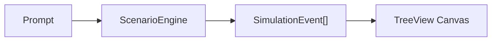
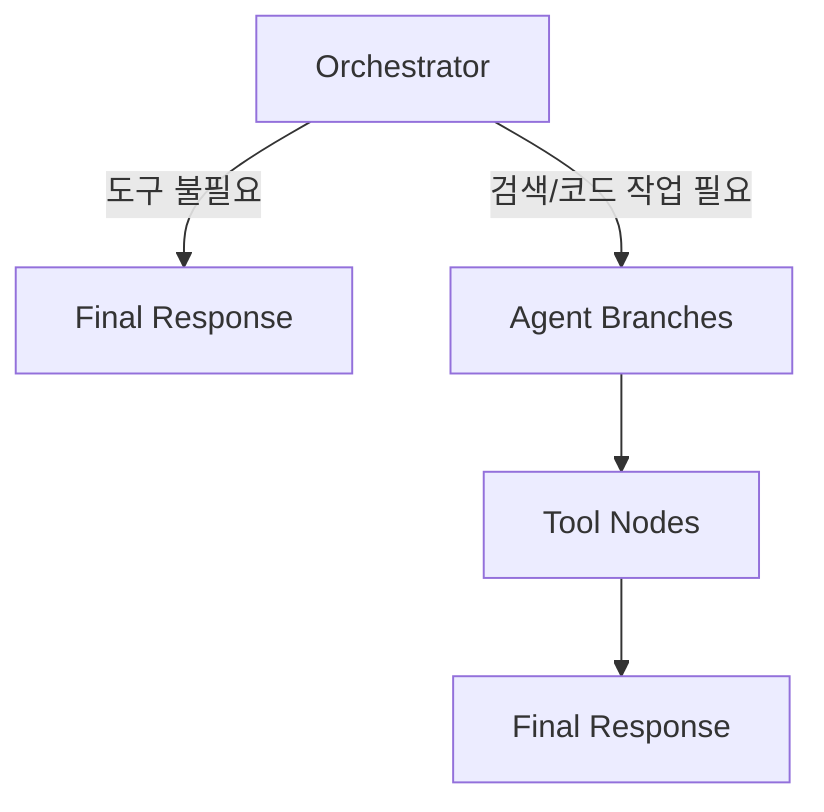

# Agent Orchestration Visualizer


GitHub Copilot, Antigravity, Codex를 오가며 만든 로컬 시뮬레이터. 단순 구현보다 오케스트레이션 구조, 상태 전이, 문서 동기화, 에이전트가 다시 읽을 수 있는 사양 분리에 초점을 둔 프로젝트.

- 입력 프롬프트를 실제 LLM/API 호출 없이 가짜 시나리오 이벤트로 변환.
- Tkinter Canvas에 에이전트 위임, 도구 실행, 최종 합류 과정을 트리로 표현.
- 목표는 답변 품질 평가가 아니라, 에이전트 오케스트레이션 흐름을 시각적으로 검증하는 것.



## 핵심 흐름

- `Orchestrator`는 항상 최상단에 1개만 생성.
- 도구가 필요한 프롬프트에서만 `Search Agent`, `Memory Agent`, `Security Monitor` 같은 브랜치 생성.
- `안녕` 같은 단순 입력은 `Orchestrator -> Final Response`로 직행.
- `Final Response`는 작업자가 아니라 브랜치 결과가 모이는 합류 노드.



## 문서

- [동작 모델](docs/behavior.md).
  - 프롬프트 분류 기준, 브랜치 생성 조건, 도구 선택 기준.

- [아키텍처](docs/architecture.md).
  - 상태 패턴, Queue/root.after, 이벤트 모델, UI 렌더링 구조.

- [문서화와 에이전트 협업](docs/agent-docs.md).
  - `.github/docs`, `AGENTS.md`, Copilot/Antigravity/Codex 협업 흔적과 사양 분리 방식.

## 실행

```powershell
python main.py
```

## 검증

```powershell
python -m py_compile main.py app/**/*.py
```

- GUI는 직접 실행하면 창이 떠서 대기.
- 자동 검증에서는 컴파일 검증, 시나리오 생성 점검, 짧은 Tkinter smoke test 우선.
