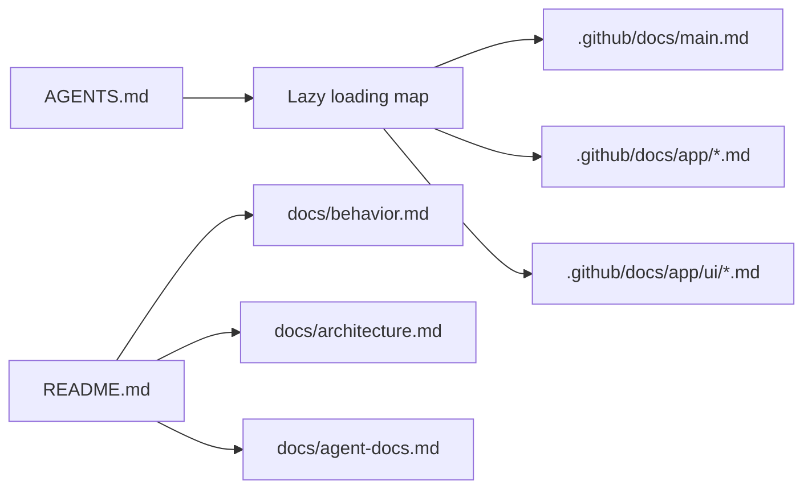

# 문서화와 에이전트 협업

사람과 AI 에이전트가 이 프로젝트를 다시 읽고 수정하기 위한 문서 구조만 다루는 문서.

GitHub Copilot, Antigravity, Codex를 오가며 만든 프로젝트. 구현 자체보다 오케스트레이션 개념, 사양 문서 분리, 변경 시 문서 동기화 규칙을 함께 다듬은 점이 특징.

## 문서 지도

## 역할 구분

- `README.md`.
  - 프로젝트의 얇은 입구.
  - 실행법과 핵심 링크만 보유.

- `docs/behavior.md`.
  - 프롬프트가 어떤 시나리오로 분류되는지만 설명.
  - 브랜치 생성 조건과 도구 선택 기준 설명.

- `docs/architecture.md`.
  - 런타임 구조와 파일별 책임만 설명.
  - 상태 패턴, Queue, 이벤트 모델, UI 렌더링 설명.

- `docs/agent-docs.md`.
  - 문서 구조와 에이전트 협업 방식 설명.
  - `.github/docs`와 `AGENTS.md`의 역할 설명.

## `.github/docs`에서 특기할 점

- `AGENTS.md`에 lazy loading map 존재.
- 에이전트가 모든 문서를 한 번에 읽지 않고 필요한 모듈 사양만 읽도록 유도.
- `main.md`는 composition root와 thread-safety 설명.
- `scenario.md`는 프롬프트 분류, 단일 Orchestrator, 조건부 브랜치, 최종 합류 노드 설명.
- `tree_view.md`는 Canvas가 세로 로그가 아니라 managed tree임을 명시.
- `events.md`는 `node_key`, `merge_parent_steps`처럼 뷰가 해석해야 하는 필드 설명.
- `tools.md`는 도구 색상과 표시명을 중앙 관리한다는 제약 설명.
- `.github/copilot-instructions.md`는 Copilot 호환을 위해 유지하는 문서.

## 변경 원칙

- 코드 변경 전 관련 사양 먼저 갱신.
- 변경 후 README 또는 `docs/`의 사용자용 설명도 필요한 만큼 동기화.
- 세부 구현 설명은 `.github/docs`에, 읽는 사람용 개요는 `docs/`에 배치.
- 문서 하나가 여러 책임을 떠안기 시작하면 분리.
