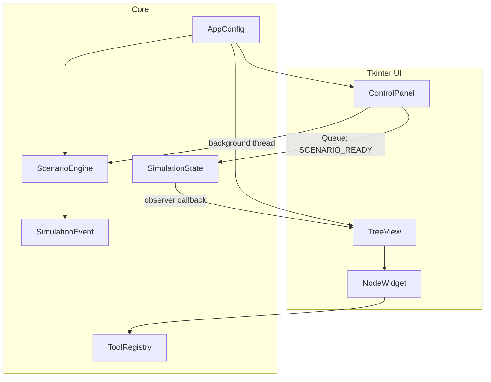
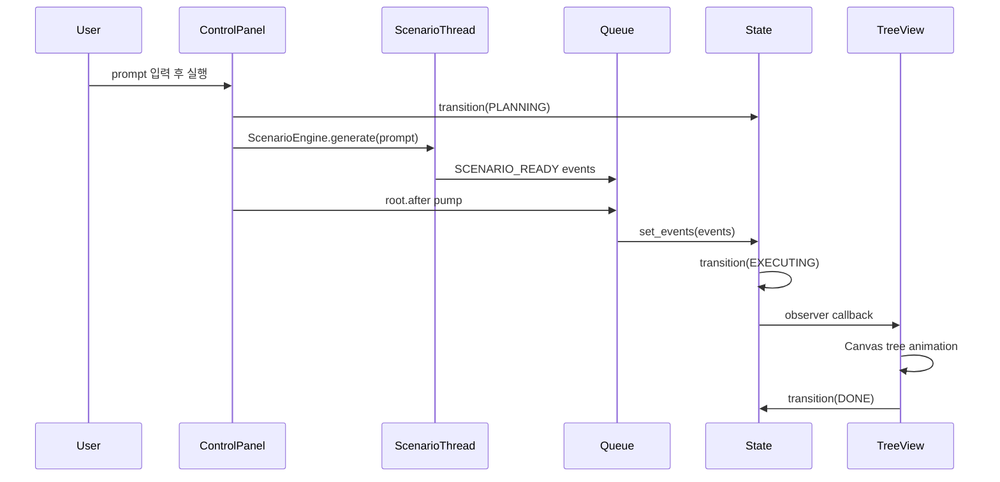

# 아키텍처

코드 구조와 런타임 흐름만 다루는 문서. 프롬프트 분류 기준은 [동작 모델](behavior.md) 참고.

## 런타임 흐름

## 주요 설계

- 상태 패턴.
  - `SimulationState`가 `IDLE`, `PLANNING`, `EXECUTING`, `COMPACTING`, `DONE` 전이 관리.
  - 상태 변경은 `transition(...)`으로만 수행.

- Observer.
  - UI 컴포넌트가 `SimulationState.subscribe(...)`로 상태 변화 구독.
  - TreeView는 `EXECUTING` 전이를 받으면 이벤트 재생 시작.

- Queue + `root.after(...)`.
  - 시나리오 생성은 백그라운드 스레드에서 실행.
  - Tkinter UI 갱신은 메인 스레드의 queue pump에서만 수행.

- 불변 이벤트 모델.
  - `SimulationEvent`는 Canvas에 그릴 동작 하나를 표현.
  - `parent_step`은 일반 트리 연결 기준.
  - `merge_parent_steps`는 여러 브랜치가 합류하는 노드 기준.

- 중앙 도구 레지스트리.
  - `ToolRegistry`가 표시명과 색상 관리.
  - UI 레이어는 도구별 색상 값을 직접 결정하지 않음.

## 파일별 책임

- `main.py`.
  - 앱 조립 지점.
  - 설정, 상태, 큐, 컨트롤 패널, 트리 뷰 연결.

- `app/config.py`.
  - `config.yaml`을 읽어 `AppConfig`로 제공.
  - 외부 YAML 라이브러리 없이 필요한 subset만 처리.

- `app/state.py`.
  - 상태 전이 규칙의 단일 출처.
  - 잘못된 상태 이동 방지.

- `app/scenario.py`.
  - 프롬프트를 이벤트 배열로 변환.
  - 실제 도구 실행이 아니라 시각화를 위한 fake planning 담당.

- `app/events.py`.
  - 뷰가 해석할 불변 이벤트 모델.
  - 노드 재사용과 합류 표현에 필요한 데이터 보유.

- `app/tools.py`.
  - 도구/에이전트 표시명과 색상 중앙 관리.

- `app/ui/tree_view.py`.
  - 이벤트를 Canvas 좌표와 애니메이션으로 변환.
  - 일반 자식과 합류 노드를 서로 다르게 배치.

- `app/ui/node.py`.
  - Canvas polygon/text item 묶음을 노드 객체처럼 관리.

- `app/ui/control_panel.py`.
  - 입력, 실행, 초기화, 상태 라벨, 컨텍스트 게이지 담당.
