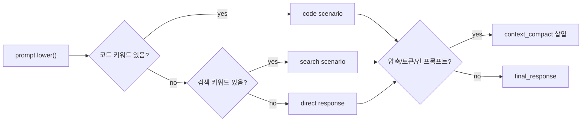
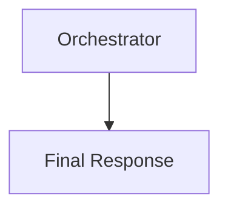
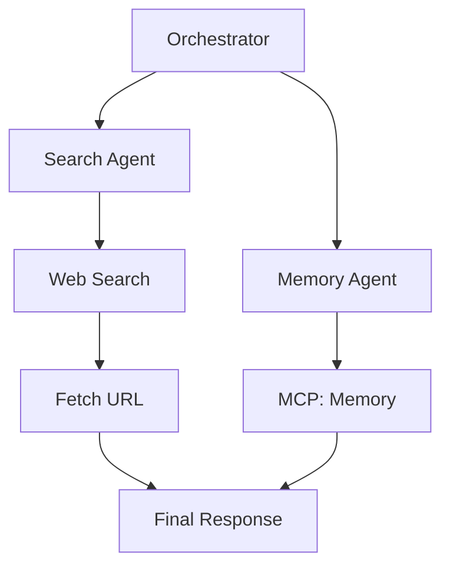
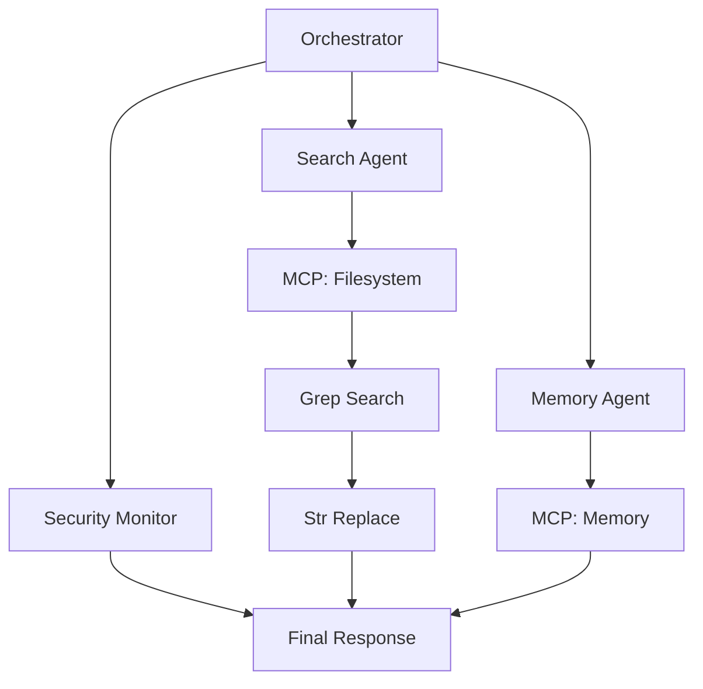

# 동작 모델

프롬프트가 어떤 시나리오로 바뀌는지만 다루는 문서. UI 구조나 파일 설명은 제외.

## 분류 기준

- 코드 계열이 검색 계열보다 우선.
- 코드 계열 기준: `코드`, `파일`, `문서`, `작업`, `버그`, `fix`, `수정`, `에러`.
- 검색 계열 기준: `검색`, `찾아`, `search`, `web`, `url`.
- 직접 응답 계열: 명확한 도구 키워드가 없을 때.
- 압축 기준: `압축`, `토큰`, `compact`가 있거나 프롬프트가 길 때.

## 직접 응답

- 예: `안녕`.
- 서브 에이전트 생성 없음.
- 도구 노드 생성 없음.
- Orchestrator가 도구 사용 불필요로 판단한 흐름.

## 검색 시나리오

- 검색 키워드가 있을 때 생성.
- Search Agent는 검색과 문서 fetch 담당.
- Memory Agent는 기존 맥락 조회 담당.
- `Final Response`는 두 브랜치 leaf에서 합류.

## 코드 시나리오

- 코드/파일/수정 키워드가 있을 때 생성.
- Search Agent는 로컬 구조 탐색과 코드 패턴 검색 흐름 담당.
- Memory Agent는 요구사항과 이전 맥락 확인 담당.
- Security Monitor는 수정 전 위험 요소 확인을 표현.

## 객체 중복 방지

- 각 이벤트는 필요하면 `node_key` 보유.
- 같은 `node_key`가 다시 오면 새 노드가 아니라 기존 노드 재사용.
- 최종 합류는 `merge_parent_steps`로 표현.
- Orchestrator 반복 생성이나 같은 동작 객체 중복 렌더링 방지.
